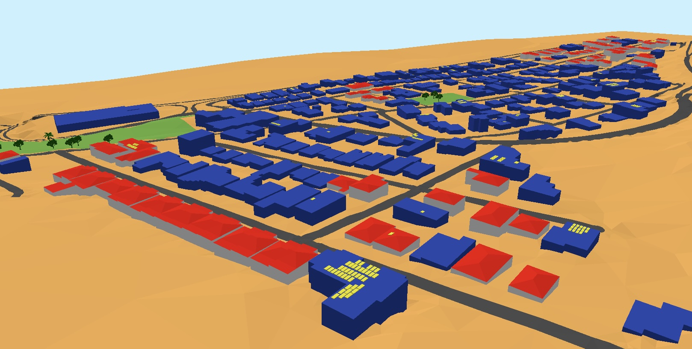

## LoD2geo3D

**LoD2geo3D** is a companion repository to [***geo3D***](https://github.com/AdrianKriger/geo3D) that demonstrates spatial data science workflows with a simplified **LoD2** city model.

The repository extends the `CityJSONdataScience` notebook from simple LoD1 building blocks to richer roof-resolved 3D urban geometry, supporting higher-order (more precise) exploratory analysis of building form, volume, and urban sustainability indicators.

### Repository aims

- demonstrate how a simplified **LoD2 CityJSON** model can be used in a Jupyter notebook workflow
- adapt the `CityJSONdataScience` workflow to richer building geometry
- provide a compact worked example that complements the main `geo3D` project
